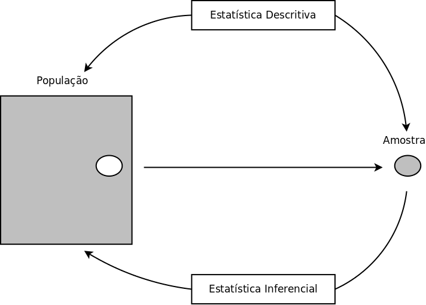

```{r setup, cache=FALSE, include=FALSE}
source("setup_knitr_slides.R")
library(xtable)
op <- par(no.readonly = TRUE)
```

# Introdução

### Inferência estatística

Seja $X$ uma variável aleatória com função densidade (ou de
probabilidade) denotada por $f(x,\theta)$, em que $\theta$ é um
parâmetro desconhecido. Chamamos de **inferência estatística** o
problema que consiste em especificar um ou mais valores para $\theta$,
baseado em um conjunto de valores $X$.

A inferência pode ser feita de duas formas:

- estimativa pontual
- estimativa intervalar

### Redução de dados

Um experimentador usa as informações em uma amostra aleatória $X_1,
\ldots, X_n$ para se fazer inferências sobre $\theta$.

Normalmente $n$ é grande e fica inviável tirar conclusões baseadas em
uma longa **lista** de números.

Por isso, um dos objetivos da inferência estatística é **resumir** as
informações de uma amostra, da maneira mais **compacta** possível, mas
que ao mesmo tempo seja também **informativa**.

Normalmente esse resumo é feito por meio de **estatísticas**, por
exemplo, a média amostral e a variância amostral.

### População e amostra

O  conjunto de valores de uma característica associada a uma coleção
de indivíduos ou objetos de interesse é dito ser uma população.

Uma sequência $X_1, \ldots, X_n$ de $n$ variáveis aleatórias
independentes e identicamente distribuídas (iid) com função
densidade (ou de probabilidade) $f(x,\theta)$ é dita ser uma amostra
aleatória de tamanho $n$ da distribuição de $X$.

Como normalmente $n>1$, então temos que a fdp ou fp conjunta será
$$
f(\boldsymbol{x, \theta}) = f(x_1, \ldots, x_n, \theta) = \prod_{i=1}^n
f(x_i, \theta).
$$

### População e amostra

```{r, out.width='80%'}

```

### Parâmetro e Estatística

**População** $\rightarrow$ **censo** $\rightarrow$ **parâmetro**

*Uma medida numérica que descreve alguma
característica da **população**, usualmente representada
por letras gregas: $\theta$, $\mu$, $\sigma$, $\ldots$*

Exemplo: média populacional = $\mu$

\vspace{1em}
\hrule
\vspace{1em}

**População** $\rightarrow$ **amostra** $\rightarrow$ **estatística**

*Uma medida numérica que descreve alguma
característica da **amostra**, usualmente denotada pela
letra grega do respectivo parâmetro com um acento circunflexo:
$\hat\theta$, $\hat\mu$, $\hat\sigma$, $\ldots$, ou por letras do
alfabeto comum: $\bar x$, $s$, $\ldots$*

Exemplo: média amostral = $\bar{x}$

### Parâmetros

É importante notar que um parâmetro não é restrito aos modelos de
probabilidade. Por exemplo:

- $X \sim \text{N}(\mu, \sigma^2)$ $\Rightarrow$ parâmetros: $\mu$, $\sigma^2$
- $Y \sim \text{Poisson}(\lambda)$ $\Rightarrow$ parâmetro: $\lambda$
- $Y = \beta_0 + \beta_1 X$ $\Rightarrow$ parâmetros: $\beta_0$, $\beta_1$
- $L_t = L_{\infty}[1 - e^{-k(t - t_0)}]$ $\Rightarrow$ parâmetros:
$L_{\infty}$, $k$, $t_0$

### Estatística

Qualquer função da amostra que não depende de parâmetros desconhecidos é
denominada uma estatística, denotada por $T(\mathbf{X}) = T(X_1, X_2,
\ldots, X_n)$

Exemplos:

- $T_1(\mathbf{X}) = \sum_{i=1}^{n} X_i = X_1 + X_2 + \cdots + X_n$
- $T_2(\mathbf{X}) = \prod_{i=1}^{n} X_i = X_1 \cdot X_2 \cdots X_n$
- $T_3(\mathbf{X}) = X_{(1)}$
- $T_4(\mathbf{X}) = \sum_{i=1}^{n} (X_i - \mu)^2$

\pause

Verificamos que $T_1$, $T_2$, $T_3$ são estatístcas, mas $T_4$
não.

Como é uma função da amostra, então uma estatística também é uma
**variável aleatória** $\rightarrow$ distribuições amostrais

### Estimador

#### Espaço paramétrico
O conjunto $\Theta$ em que $\theta$ pode assumir seus valores é
chamado de **espaço paramétrico**

#### Estimador
Qualquer estatística que assume valores em $\Theta$ é um estimador
para $\theta$.

#### Estimador pontual
Dessa forma, um **estimador pontual** para $\theta$ é qualquer
estatística que possa ser usada para estimar esse parâmetro, ou seja,
$$\hat{\theta} = T(\mathbf{X})$$

### Estimador

**Observações:**

1. Todo estimador é uma estatística, mas nem toda estatística é um
estimador.
2. O valor assumido pelo estimador pontual é chamado de
**estimativa pontual**,$$T(\mathbf{X}) = T(X_1, \ldots, X_n) = t$$
ou seja, o estimador é uma **função** da amostra, e a estimativa
é o **valor observado** de um estimador (um número) de uma
amostra particular.
